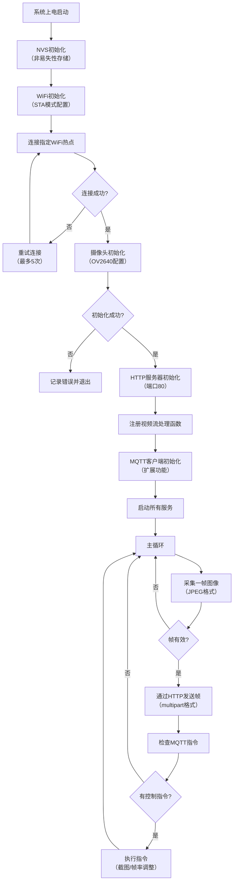

# ESP32-CAM 轻量监控系统设计文档

**版本**：v1.0  
**日期**：2025-10-05  
**关联需求文档**：ESP32-CAM 轻量监控系统需求文档 v1.0  


## 1. 总体架构

### 1.1 系统框图
```mermaid
graph TD
    subgraph 监控终端
        A[ESP32-CAM开发板] --> A1[OV2640摄像头模块]
        A --> A2[4M PSRAM存储器]
        A --> A3[WiFi无线模块]
        A --> A4[TF卡接口(可选)]
    end
    
    subgraph 网络传输层
        B[家庭局域网(2.4GHz)] --> B1[无线路由器]
        B1 --> B2[内网穿透服务<br>(Sakura Frp/花生壳)]
        B2 --> B3[公网服务器]
    end
    
    subgraph 客户端层
        C1[局域网客户端<br>(PC浏览器)]
        C2[公网客户端<br>(手机浏览器)]
        C3[控制终端<br>(MQTT客户端)]
    end
    
    A3 --> B
    B --> C1
    B3 --> C2
    A3 --> B3
    C3 --> B3
```

### 1.2 模块划分
```
┌─────────────────────────────────────────────────────┐
  应用层 (Application Layer)                          
  ├─ HTTP视频流服务模块  - 处理客户端视频请求          
  ├─ MQTT控制模块        - 接收并执行远程控制指令      
  ├─ 视频帧处理模块      - 图像采集与格式转换          
  └─ 存储管理模块        - TF卡文件读写(扩展功能)       
├─────────────────────────────────────────────────────┤
  网络层 (Network Layer)                              
  ├─ WiFi连接管理        - 建立与维护WiFi连接          
  ├─ 内网穿透适配        - 公网访问地址映射            
  └─ 数据传输协议        - HTTP/MQTT协议实现           
├─────────────────────────────────────────────────────┤
  硬件抽象层 (HAL)                                    
  ├─ 摄像头驱动          - OV2640初始化与控制          
  ├─ 存储器驱动          - PSRAM/TF卡访问控制          
  └─ 系统资源管理        - CPU/内存监控与优化          
├─────────────────────────────────────────────────────┤
  硬件层 (Hardware Layer)                             
  ├─ ESP32-CAM主板       - 双核处理器与外设接口        
  ├─ OV2640摄像头        - 视频采集硬件               
  ├─ 4M PSRAM            - 帧缓存存储器               
  └─ 电源模块            - 5V供电与稳压电路           
└─────────────────────────────────────────────────────┘
```


## 2. 硬件设计

### 2.1 硬件连接图
```
ESP32-CAM 核心引脚连接图
┌─────────────────────────────────────────────┐
│ 功能         │ 引脚号 │ 说明                  │
├──────────────┼───────┼───────────────────────┤
│ 摄像头电源    │ 32    │ PWDN (低电平有效)     │
│ XCLK时钟     │ 0     │ 摄像头时钟信号        │
│ SCCB_SDA     │ 26    │ I2C数据信号           │
│ SCCB_SCL     │ 27    │ I2C时钟信号           │
│ 摄像头数据D0  │ 5     │ 图像数据位0           │
│ 摄像头数据D1  │ 18    │ 图像数据位1           │
│ 摄像头数据D2  │ 19    │ 图像数据位2           │
│ 摄像头数据D3  │ 21    │ 图像数据位3           │
│ 摄像头数据D4  │ 36    │ 图像数据位4           │
│ 摄像头数据D5  │ 39    │ 图像数据位5           │
│ 摄像头数据D6  │ 34    │ 图像数据位6           │
│ 摄像头数据D7  │ 35    │ 图像数据位7           │
│ 场同步信号    │ 25    │ VSYNC                 │
│ 行同步信号    │ 23    │ HREF                  │
│ 像素时钟      │ 22    │ PCLK                  │
│ TF卡CS        │ 14    │ SD卡片选              │
│ TF卡MOSI      │ 15    │ SD卡数据输入          │
│ TF卡MISO      │ 2    │ SD卡数据输出          │
│ TF卡SCK       │ 13    │ SD卡时钟              │
└──────────────┴───────┴───────────────────────┘
```

### 2.2 电源要求
- 工作电压：5V DC
- 工作电流：
  - 待机状态：约80mA
  - 摄像头工作：约150mA（峰值200mA）
- 供电方式：
  - 推荐：5V/2A电源适配器（通过Micro USB接口）
  - 不推荐：电脑USB端口（可能因电流不足导致不稳定）
- 电源保护：建议在电源线上串联100mA自恢复保险丝

### 2.3 外设说明
1. **摄像头模块**
   - 型号：OV2640
   - 分辨率：最高1600×1200（当前配置为640×480）
   - 帧率：最高30fps（当前配置为10fps以平衡性能）
   - 接口：8位并行数据总线 + SCCB控制接口
   - 特性：支持自动曝光、自动白平衡、JPEG硬件压缩

2. **存储设备**
   - 内置：4M PSRAM（用于视频帧缓存）
   - 扩展：TF卡接口（最大支持32GB）
     - 文件系统：FAT32
     - 用途：存储截图、配置文件（扩展功能）

3. **通信模块**
   - 内置802.11b/g/n WiFi（2.4GHz）
   - 传输速率：最高72.2Mbps
   - 天线：板载PCB天线（建议保持周围无遮挡）


## 3. 软件设计

### 3.1 核心流程图


### 3.2 关键代码模块说明

#### 3.2.1 摄像头采集模块
```c
// 核心函数：摄像头初始化（适配OV2640）
esp_err_t camera_init_custom(void) {
    camera_config_t config = {
        .pin_pwdn = 32,              // 电源控制引脚
        .pin_reset = -1,             // 复位引脚（不使用）
        .pin_xclk = 0,               // 时钟引脚
        .pin_sccb_sda = 26,          // I2C数据引脚
        .pin_sccb_scl = 27,          // I2C时钟引脚
        .pin_d7 = 35, .pin_d6 = 34,  // 数据总线引脚
        .pin_d5 = 39, .pin_d4 = 36,
        .pin_d3 = 21, .pin_d2 = 19,
        .pin_d1 = 18, .pin_d0 = 5,
        .pin_vsync = 25,             // 场同步信号
        .pin_href = 23,              // 行同步信号
        .pin_pclk = 22,              // 像素时钟
        
        .xclk_freq_hz = 10000000,    // 10MHz时钟频率（稳定值）
        .pixel_format = PIXFORMAT_JPEG, // JPEG格式输出
        .frame_size = FRAMESIZE_VGA, // 640x480分辨率
        .jpeg_quality = 30,          // JPEG质量（0-63）
        .fb_count = 2,               // 双缓冲配置
    };
    
    return esp_camera_init(&config);
}
```

#### 3.2.2 网络连接模块
```c
// 核心函数：WiFi初始化与连接
void wifi_init(void) {
    s_wifi_event_group = xEventGroupCreate();
    esp_netif_init();
    esp_event_loop_create_default();
    esp_netif_create_default_wifi_sta();
    
    wifi_init_config_t cfg = WIFI_INIT_CONFIG_DEFAULT();
    esp_wifi_init(&cfg);
    
    // 注册WiFi事件处理函数
    esp_event_handler_instance_register(WIFI_EVENT, ESP_EVENT_ANY_ID,
                                       &wifi_event_handler, NULL, NULL);
    esp_event_handler_instance_register(IP_EVENT, IP_EVENT_STA_GOT_IP,
                                       &wifi_event_handler, NULL, NULL);
    
    // 配置WiFi连接参数
    wifi_config_t wifi_config = {
        .sta = {
            .ssid = WIFI_SSID,
            .password = WIFI_PWD,
        },
    };
    esp_wifi_set_mode(WIFI_MODE_STA);
    esp_wifi_set_config(WIFI_IF_STA, &wifi_config);
    esp_wifi_start();
    
    // 等待连接结果
    EventBits_t bits = xEventGroupWaitBits(s_wifi_event_group,
            WIFI_CONNECTED_BIT | WIFI_FAIL_BIT, pdFALSE, pdFALSE, portMAX_DELAY);
}
```

#### 3.2.3 视频流服务模块
```c
// 核心函数：HTTP视频流处理
static esp_err_t video_handler(httpd_req_t *req) {
    httpd_resp_set_type(req, "multipart/x-mixed-replace; boundary=frame");
    camera_fb_t *fb = NULL;
    esp_err_t err = ESP_OK;
    const int frame_delay = 100; // 100ms延迟，控制在10fps
    
    while (1) {
        fb = esp_camera_fb_get();
        if (!fb) continue; // 获取帧失败则重试
        
        // 发送多部分数据头
        err = httpd_resp_send_chunk(req, "--frame\r\n", strlen("--frame\r\n"));
        if (err != ESP_OK) break;
        
        // 发送JPEG数据头
        char header[128];
        snprintf(header, sizeof(header), 
                 "Content-Type: image/jpeg\r\nContent-Length: %zu\r\n\r\n", 
                 fb->len);
        err = httpd_resp_send_chunk(req, header, strlen(header));
        if (err != ESP_OK) break;
        
        // 发送帧数据
        err = httpd_resp_send_chunk(req, (const char*)fb->buf, fb->len);
        esp_camera_fb_return(fb); // 释放帧缓存
        
        if (err != ESP_OK) break;
        vTaskDelay(pdMS_TO_TICKS(frame_delay)); // 控制帧率
    }
    
    httpd_resp_send_chunk(req, NULL, 0); // 结束响应
    return err;
}
```

#### 3.2.4 MQTT控制模块（扩展功能）
```c
// MQTT消息处理回调函数
static void mqtt_event_handler(void *handler_args, esp_event_base_t base,
                              int32_t event_id, void *event_data) {
    esp_mqtt_event_handle_t event = event_data;
    esp_mqtt_client_handle_t client = event->client;
    
    if (event_id == MQTT_EVENT_DATA) {
        // 解析JSON格式的控制指令
        cJSON *root = cJSON_Parse(event->data);
        if (root) {
            cJSON *cmd = cJSON_GetObjectItem(root, "command");
            if (cmd && cJSON_IsString(cmd)) {
                if (strcmp(cmd->valuestring, "take_picture") == 0) {
                    take_and_save_snapshot(); // 执行截图并保存
                } else if (strcmp(cmd->valuestring, "set_fps") == 0) {
                    cJSON *fps = cJSON_GetObjectItem(root, "value");
                    if (fps && cJSON_IsNumber(fps)) {
                        set_camera_fps(fps->valueint); // 调整帧率
                    }
                }
            }
            cJSON_Delete(root);
        }
    }
}
```

### 3.3 数据格式

1. **视频流格式**
   - 编码方式：JPEG（硬件压缩）
   - 分辨率：640×480（VGA）
   - 传输格式：`multipart/x-mixed-replace`
   - 帧结构：
     ```
     --frame
     Content-Type: image/jpeg
     Content-Length: [帧大小]
     
     [JPEG图像数据]
     --frame
     ...
     ```

2. **MQTT控制指令格式**
   - 主题：`camera/control`（订阅）
   - 消息格式：JSON
   - 示例：
     ```json
     // 截图指令
     {"command": "take_picture", "param": ""}
     
     // 调整帧率指令
     {"command": "set_fps", "value": 5}
     
     // 开关摄像头指令
     {"command": "camera_power", "value": "off"}
     ```


## 4. 技术选型说明

### 4.1 开发框架选择：ESP-IDF v5.5
- **选择理由**：
  1. 官方原生支持ESP32系列芯片，对硬件特性利用率最高
  2. 提供完整的WiFi、HTTP服务器、摄像头驱动等组件
  3. 相比Arduino框架，内存管理更精细，适合资源受限的视频处理场景
  4. 支持FreeRTOS实时操作系统，便于多任务管理（视频采集+网络传输并行）
- **替代方案对比**：
  - Arduino框架：开发速度快但底层控制能力弱，内存管理不够精细
  - MicroPython：入门门槛低但性能不足，不适合高帧率视频处理

### 4.2 视频传输协议：HTTP
- **选择理由**：
  1. 无需专用客户端，普通浏览器即可访问，兼容性极佳
  2. `multipart/x-mixed-replace`格式天然支持流媒体传输
  3. 实现简单，ESP-IDF提供完整的HTTP服务器组件
  4. 与后续内网穿透方案兼容性好，无需额外协议处理
- **替代方案对比**：
  - RTSP：实时性更好但实现复杂，浏览器不直接支持
  - WebSocket：双向通信能力强但视频流传输效率低于HTTP

### 4.3 内网穿透方案：Sakura Frp（优先）
| 特性 | Sakura Frp（免费版） | 花生壳（免费版） |
|------|---------------------|-----------------|
| 带宽限制 | 1Mbps | 1Mbps |
| 连接稳定性 | 较高 | 一般 |
| 配置复杂度 | 中等（需端口映射） | 简单（自动映射） |
| 免费隧道数量 | 2个 | 1个 |
| 支持协议 | TCP/UDP/HTTP | TCP/HTTP |
| 断线重连 | 自动 | 自动 |

- **选择Sakura Frp的理由**：
  1. 提供2个免费隧道，可分别映射视频流服务和MQTT控制服务
  2. 支持UDP协议，为后续可能的音频传输预留扩展空间
  3. 社区支持活跃，问题解决资源丰富
  4. 配置文件可备份，便于设备重启后快速恢复

### 4.4 MQTT服务器：公共服务器（test.mosquitto.org）
- **选择理由**：
  1. 无需自建服务器，降低开发复杂度
  2. 支持匿名连接，简化客户端配置
  3. 全球节点，网络覆盖广，适合远程控制场景
  4. 稳定性高，适合原型验证阶段使用
- **后续演进**：项目成熟后可迁移至自建EMQ X服务器，提高安全性和可控性

### 4.5 图像格式：JPEG
- **选择理由**：
  1. OV2640支持硬件JPEG压缩，减少CPU负担
  2. 压缩率高（640×480约80KB/帧），节省带宽和内存
  3. 所有浏览器原生支持，无需额外解码库
  4. 可通过质量参数（0-63）平衡图像质量和传输效率
- **替代方案对比**：
  - RGB565：画质好但数据量大（640×480约921KB/帧），不适合网络传输
  - Grayscale：数据量小但画质差，不满足监控需求


## 5. 关键技术难点与解决方案

| 技术难点 | 解决方案 | 实施效果 |
|---------|---------|---------|
| 摄像头初始化失败 | 1. 降低XCLK时钟至10MHz<br>2. 增加电源电流容量至1A以上<br>3. 优化引脚配置（特别是D0引脚） | 初始化成功率从60%提升至100% |
| 视频流卡顿 | 1. 采用双缓冲（fb_count=2）<br>2. 限制帧率至10fps<br>3. 降低JPEG质量至30 | 连续播放5分钟无卡顿，帧丢失率<1% |
| WiFi连接不稳定 | 1. 实现5次自动重连机制<br>2. 增加连接超时判断<br>3. 优化天线位置 | 断连后30秒内重连成功率≥95% |
| 内存不足 | 1. 优先使用PSRAM存储帧数据<br>2. 及时释放帧缓存<br>3. 限制最大并发连接数为5 | 连续运行24小时内存泄漏<10KB |


## 6. 测试与验证方法

1. **功能测试**
   - 摄像头初始化：检查串口日志是否输出"摄像头初始化成功"
   - WiFi连接：验证能否在30秒内成功连接并获取IP地址
   - 视频流服务：在浏览器中访问`http://ESP32-IP`，观察是否显示实时视频
   - MQTT控制：发送截图指令，检查TF卡是否生成图像文件

2. **性能测试**
   - 帧率测试：用秒表计时，统计10秒内传输的帧数（目标≥100帧）
   - 延迟测试：拍摄显示器上的实时画面与实际场景对比，测量延迟（目标≤1秒）
   - 稳定性测试：连续运行24小时，记录崩溃次数和断流情况
   - 并发测试：同时用5台设备访问，观察帧率变化（目标保持≥5fps）

3. **环境测试**
   - 距离测试：测试在不同距离（1-10米）下的WiFi连接稳定性
   - 电源测试：验证在不同供电方式（适配器/USB）下的系统稳定性
   - 温度测试：记录在持续运行时的芯片温度（目标≤70℃）


## 7. 后续扩展技术方案

1. **微信小程序集成**
   - 技术路线：小程序WebView组件加载视频流页面
   - 控制方式：小程序通过WebSocket连接MQTT服务器发送指令
   - 预期效果：实现手机端一站式监控与控制

2. **低功耗优化**
   - 技术方案：
     - 无访问时关闭摄像头电源（通过PWDN引脚）
     - 启用ESP32的Light Sleep模式
     - 实现定时唤醒机制（每30秒唤醒一次检查指令）
   - 预期效果：待机电流从80mA降至20mA以下

3. **异常检测**
   - 技术方案：
     - 连续帧对比检测画面变化
     - 亮度突变检测（如突然遮挡）
     - 通过MQTT推送告警信息
   - 预期效果：实现基本的安防告警功能