# ESP32-CAM 轻量监控系统需求文档
**版本**：v1.0  
**日期**：2025-10-05  
**修改记录**：  
- v1.0：基于硬件实际参数，完成局域网实时视频核心功能适配，覆盖OV2640/OV7670摄像头、4M PSRAM等硬件特性，包含性能指标及调试问题记录  

## 1. 项目概述
### 1.1 项目背景与意义
当前校园/租房场景下，轻量监控需求（如查看3D打印机状态、租房内绿植情况、宿舍安防）日益增长，但商用监控设备存在“成本高（需额外购买摄像头+云服务）、部署复杂”的问题。本项目基于ESP32-CAM成品开发板（匹配商家硬件参数，无额外支出），实现**低成本、易部署的局域网实时监控**，后续可扩展公网访问、TF卡存储、一键配网等功能，为实习简历积累“嵌入式硬件+网络通信”的完整项目经验，同时满足轻量监控的实际需求。

### 1.2 目标用户与场景
| 目标用户       | 核心使用场景                                                                 |
|----------------|------------------------------------------------------------------------------|
| 学生群体       | 宿舍内安防监控（查看陌生人进入情况）、远程查看实验室3D打印机打印状态         |
| 租房用户       | 出门后通过局域网（连接家庭WiFi）查看家中门窗状态、宠物活动（短距离轻量监控）  |
| 嵌入式学习者   | 作为“硬件调试+网络服务”的实战案例，掌握ESP32外设驱动、HTTP视频流推送技术     |

## 2. 功能需求
### 2.1 核心功能（已实现/当前重点）
| 功能模块         | 具体需求描述                                                                 | 验收标准（可量化）                                                                 |
|------------------|------------------------------------------------------------------------------|----------------------------------------------------------------------------------|
| 摄像头视频采集   | 1. 支持OV2640/OV7670摄像头（当前适配OV2640），输出JPEG格式视频流； 2. 分辨率640x480（VGA），帧率≥10fps； 3. 双缓冲（`fb_count=2`）减少帧丢失 | 1. 串口打印“摄像头初始化成功”，无报错； 2. 单帧JPEG数据大小≤100KB，连续采集5分钟无帧丢失 |
| 局域网HTTP访问   | 1. 搭建HTTP服务（默认端口80），支持浏览器访问； 2. 视频流格式兼容Chrome/Safari，无需专用客户端 | 1. 浏览器输入`http://ESP32-IP`，实时显示视频； 2. 2台设备同时访问，帧率保持≥8fps |
| WiFi自动重连     | 1. 支持STA模式连接指定WiFi（SSID/密码可配置）； 2. 断连后自动重试（最多5次），重试间隔3秒 | 1. WiFi断连后30秒内重连成功； 2. 重试5次失败时，串口打印“WiFi连接失败”告警     |
| 内存监控         | 1. 启动时检查**4M PSRAM**可用容量； 2. PSRAM不足512KB时打印告警，避免帧缓存溢出     | 1. 串口输出“内部内存可用XX字节”“PSRAM可用XX字节”； 2. PSRAM不足时不触发摄像头初始化崩溃 |

### 2.2 非核心功能（预留扩展，匹配硬件参数）
| 功能模块         | 扩展需求描述                                                                 | 后续实现规划                                                                 |
|------------------|------------------------------------------------------------------------------|------------------------------------------------------------------------------|
| 公网访问         | 通过内网穿透工具（Sakura Frp/花生壳），实现手机4G/外网访问视频流              | 1. 配置TCP隧道映射ESP32的80端口； 2. 手机浏览器输入公网地址+端口访问         |
| MQTT远程控制     | 支持远程截图（保存至TF卡）、摄像头开关、帧率调整                             | 1. 连接公共MQTT服务器（`test.mosquitto.org:1883`）； 2. 订阅`camera/control`主题接收指令 |
| 低功耗模式       | 利用硬件“多种休眠模式”特性，实现摄像头关闭时浅度休眠（电流≤50mA）             | 1. 新增`camera_off()`接口关闭摄像头； 2. 调用`esp_deep_sleep_start()`进入休眠 |
| TF卡存储         | 支持TF卡读写，实现视频帧本地存储（匹配硬件“支持TF卡”特性）                   | 1. 集成FATFS文件系统； 2. 实现`tf_save_frame()`接口保存JPEG帧               |
| 一键配网         | 支持Smart Config/AirKiss一键配网（匹配硬件“一键配网”特性），简化WiFi配置     | 1. 集成ESP-IDF一键配网API； 2. 手机APP发送配网指令，自动连接WiFi           |

## 3. 性能需求
| 性能指标         | 目标值                          | 测试方法                                                                 |
|------------------|---------------------------------|--------------------------------------------------------------------------|
| 视频分辨率       | 640x480（VGA）                  | 用图像查看工具打开截图，确认分辨率属性为640x480                             |
| 视频帧率         | ≥10fps（局域网）                | 浏览器播放视频时，用秒表计时，统计10秒内画面帧数≥100帧                     |
| 访问延迟         | 局域网≤1秒，公网（扩展后）≤3秒  | 1. 局域网：手机拍摄ESP32摄像头画面+浏览器显示画面，对比延迟； 2. 公网：用4G网络测试，延迟≤3秒 |
| 稳定性           | 连续运行≥24小时无崩溃           | 通电后持续运行24小时，检查串口日志无异常重启，浏览器访问无断流               |
| 并发能力         | 支持≤5台设备同时访问             | 同时用5台电脑浏览器访问`http://ESP32-IP`，帧率保持≥5fps                     |

## 4. 约束条件
### 4.1 硬件限制（匹配商家参数）
| 硬件参数         | 限制描述                                                                 | 应对措施                                                                 |
|------------------|--------------------------------------------------------------------------|--------------------------------------------------------------------------|
| ESP32-CAM硬件    | 1. CPU：双核32位（240MHz，600DMIPS）； 2. 内存：520KB内部RAM + **4M PSRAM**； 3. 摄像头：支持OV2640/OV7670（当前优先适配OV2640） | 1. 视频流处理单线程，避免多任务占用CPU； 2. 帧缓存用PSRAM，不占用内部RAM； 3. 后续可扩展OV7670适配（需修改引脚/寄存器配置） |
| 供电需求         | 峰值电流≥150mA（摄像头工作时）   | 1. 用≥1A电源适配器供电； 2. 避免用电脑USB口（电流不足易导致摄像头初始化失败） |

### 4.2 网络环境约束
| 网络参数         | 要求                                                                 | 验证方法                                                                 |
|------------------|----------------------------------------------------------------------|--------------------------------------------------------------------------|
| WiFi频段         | 2.4GHz（ESP32不支持5GHz）                                           | 连接2.4GHz WiFi热点，确认ESP32能正常获取IP                                 |
| 局域网带宽       | 上传带宽≥1Mbps                                                       | 用测速工具（如Speedtest）测试WiFi上传带宽，确保≥1Mbps                       |
| 公网穿透（扩展） | 免费版工具带宽≥1Mbps（如Sakura Frp免费版）                           | 用公网访问时，测试视频流卡顿率≤5%                                          |

### 4.3 成本约束
- 无额外硬件支出：基于现有ESP32-CAM成品板（含OV2640摄像头、USB供电、4M PSRAM），无需购买云服务器、额外传感器；  
- 软件工具免费：开发环境（ESP-IDF v5.5、VSCode）、内网穿透工具（Sakura Frp免费版、花生壳免费版）均使用免费资源。

## 5. 系统框图与流程图
### 5.1 系统总体框图（draw.io可导入）

```mermaid
graph TD
    A[ESP32-CAM硬件（商家参数版）] --> A1[OV2640/OV7670摄像头]
    A --> A2[4M PSRAM（帧缓存）]
    A --> A3[CH340串口芯片（调试）]
    A --> A4[TF卡接口（预留扩展）]
    B[软件层] --> B1[底层驱动：UART/SPI/I2C]
    B --> B2[中间层：WiFi管理+摄像头驱动（OV2640/OV7670适配）]
    B --> B3[应用层：HTTP视频服务+内存监控]
    C[外部交互] --> C1[局域网浏览器（Chrome/Safari）]
    C --> C2[电源（≥1A适配器）]
    C --> C3[TF卡（扩展后存储帧数据）]
    B3 --> C1[实时视频流推送]
    A1 --> B2[JPEG帧采集]
    B2 --> B3[帧数据封装]
    B3 --> C3[帧数据本地存储（扩展后）]
```

### 5.2 系统初始化流程图

## 6. 调试问题记录（已解决）
| 问题描述                          | 发生场景                                  | 解决方案                                                                 | 验证结果                          |
|-----------------------------------|-------------------------------------------|--------------------------------------------------------------------------|-----------------------------------|
| 编译报错“esp_camera.h: No such file or directory” | 首次编译代码时                            | 1. 在项目`components`目录克隆`git clone https://github.com/espressif/esp32-camera.git`； 2. 根`CMakeLists.txt`添加`set(EXTRA_COMPONENT_DIRS ${CMAKE_CURRENT_SOURCE_DIR}/components/esp32-camera)` | 编译无报错，头文件正常引用        |
| 摄像头初始化失败（错误码ESP_ERR_CAMERA_TIMEOUT） | 通电后启动，串口打印超时错误              | 1. 代码中降低`xclk_freq_hz`至10MHz（原20MHz）； 2. 更换≥1A电源适配器，避免供电不足 | 初始化成功率从60%提升至100%        |
| 视频流画面花屏，帧数据无效        | 浏览器访问时画面出现乱码、撕裂            | 1. 代码中增加JPEG有效性校验（检查首字节`0xFF 0xD8 0xFF`）； 2. 丢弃无效帧并重试获取 | 花屏概率从30%降至0，流稳定性提升  |
| WiFi频繁断连，重连无响应          | 距离路由器≥5米时                          | 1. 代码中增加WiFi事件监听（`WIFI_EVENT_STA_DISCONNECTED`）； 2. 断连后自动重试5次，间隔3秒 | 断连后30秒内重连成功率≥95%        |

## 7. 后续扩展规划（版本迭代，匹配硬件特性）
| 版本   | 计划功能                | 预期完成时间 | 核心价值                                                                 |
|--------|-------------------------|--------------|--------------------------------------------------------------------------|
| v2.0   | 公网访问（内网穿透）+ TF卡存储 | 2025-10-08   | 突破局域网限制，实现外网访问；同时支持视频帧本地存储，避免流中断丢失数据     |
| v3.0   | MQTT远程控制+一键配网   | 2025-10-10   | 实现“远程交互+简化配置”，支持截图、摄像头开关，且无需手动输入WiFi信息       |
| v4.0   | 低功耗优化+OV7670适配   | 2025-10-15   | 降低待机功耗，同时扩展摄像头型号支持，适配更多场景（如OV7670的高帧率模式）|