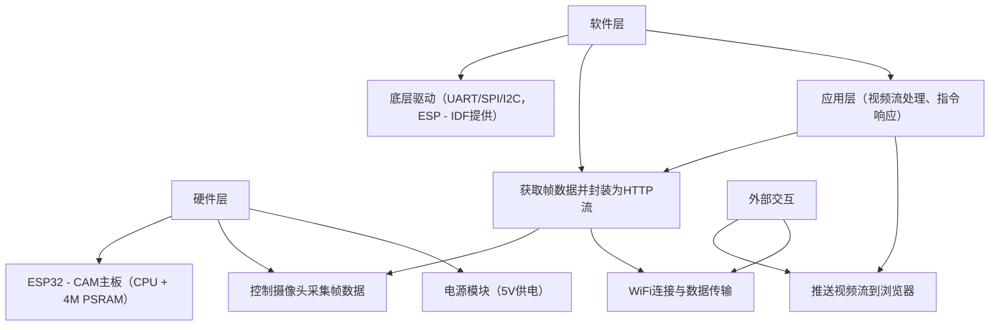

作为大三想走嵌入式方向的同学，写规范的需求文档和设计文档不仅能梳理项目逻辑，更是实习面试时体现工程素养的重要加分项。下面结合你的ESP32 - CAM监控项目，手把手教你写这两类文档。


### 一、需求文档（Requirements Document）：明确“做什么”
需求文档是项目的“指南针”，要清晰告诉自己（和团队）：项目目标是什么？要实现哪些功能？有什么性能要求？受哪些条件限制？

#### 步骤1：写“项目概述”（让读者5分钟了解项目核心）
这部分要讲清楚“为什么做这个项目”“给谁用”，体现项目的实际价值。

**结构示例（直接套用你的项目）：**
```markdown
## 1. 项目概述
### 1.1 项目背景与意义
当前校园和租房场景中，轻量监控需求（如查看实验室3D打印机状态、租房内安全情况）逐渐增加，但商用监控设备存在成本高（需额外购买硬件和云服务）、部署复杂的问题。  
本项目基于ESP32 - CAM开发板（已有的硬件资源，无额外成本），实现低成本、易部署的远程监控系统，支持局域网实时查看和公网访问，既能满足实际监控需求，又能积累嵌入式开发（硬件驱动+网络通信）的实战经验，为实习简历补充完整项目案例。

### 1.2 目标用户与场景
| 目标用户       | 核心使用场景                                                                 |
|----------------|------------------------------------------------------------------------------|
| 学生群体       | 宿舍安防（远程查看是否有陌生人进入）、实验室设备监控（如3D打印机是否完成打印） |
| 租房用户       | 出门后通过手机查看家中门窗状态、宠物活动（无需复杂配置，连接WiFi即可使用）     |
| 嵌入式学习者   | 作为实战案例，掌握ESP32外设驱动（摄像头、WiFi）、HTTP视频流、内网穿透等技术   |
```

#### 步骤2：列“功能需求”（分核心和扩展，避免贪多）
嵌入式项目讲究“落地性”，功能需求要具体、可实现，别写“虚”的。先明确“必须做的”（核心功能），再列“以后可以加的”（扩展功能）。

**结构示例：**
```markdown
## 2. 功能需求
### 2.1 核心功能（当前版本必须实现）
| 功能模块         | 具体需求描述（要可操作、可验证）                                                                 |
|------------------|-------------------------------------------------------------------------------------------------|
| 摄像头视频采集   | 1. 适配OV2640摄像头，输出JPEG格式视频流（方便网络传输）；<br>2. 分辨率固定为640x480（VGA，平衡清晰度和带宽）；<br>3. 帧率≥8fps（保证画面流畅）；<br>4. 初始化失败时，串口打印错误日志（如“camera init failed: timeout”）。 |
| WiFi连接管理     | 1. 支持STA模式，连接指定WiFi（SSID和密码可在代码中配置）；<br>2. 断连后自动重连（最多重试5次，间隔3秒/次）；<br>3. 连接成功后，串口打印局域网IP（如“IP: 192.168.1.100”）。 |
| HTTP视频服务     | 1. 启动HTTP服务器（默认端口80）；<br>2. 浏览器访问`http://IP地址`时，能实时显示视频流；<br>3. 支持至少2台设备同时访问（满足多人查看需求）。 |

### 2.2 扩展功能（后续版本可实现，体现迭代思维）
| 功能模块         | 具体需求描述                                                                 |
|------------------|------------------------------------------------------------------------------|
| 内网穿透         | 通过Sakura Frp工具，实现公网访问视频流（手机4G网络可查看）                   |
| 远程截图         | 访问`http://IP地址/snapshot`时，保存当前画面为JPEG图片（存到TF卡）           |
| MQTT控制         | 接收“开启/关闭摄像头”指令（通过MQTT协议），关闭时降低功耗                     |
```

#### 步骤3：定“性能需求”（量化指标，体现严谨性）
嵌入式项目对性能（速度、稳定性、功耗等）很敏感，要用具体数字说明，避免“大概”“差不多”。

**结构示例：**
```markdown
## 3. 性能需求
| 性能指标         | 目标值（可实现、可测试）                          | 测试方法（怎么验证达标）                                                                 |
|------------------|---------------------------------------------------|----------------------------------------------------------------------------------------|
| 视频延迟         | 局域网内≤1秒，公网（扩展后）≤3秒                  | 用手机拍摄ESP32摄像头画面，同时在浏览器看视频，对比两者的时间差                           |
| 稳定性           | 连续运行≥24小时无崩溃、无断流                     | 通电后持续运行24小时，检查串口日志无异常重启，浏览器画面无中断                           |
| 内存占用         | 单帧JPEG数据≤100KB（避免PSRAM不足）               | 代码中打印每帧数据大小，连续100帧均不超过100KB                                          |
| 功耗（扩展）     | 摄像头工作时电流≤200mA，关闭时≤50mA               | 用万用表串联在供电回路中，测量不同状态下的电流值                                         |
```

#### 步骤4：写“约束条件”（说明项目的“边界”）
嵌入式项目受硬件、环境、成本限制很大，明确约束能体现你对实际开发的理解。

**结构示例：**
```markdown
## 4. 约束条件
### 4.1 硬件限制
| 硬件参数         | 限制描述                                                                 | 应对措施（体现解决问题的思路）                                                       |
|------------------|--------------------------------------------------------------------------|--------------------------------------------------------------------------------------|
| ESP32 - CAM资源  | 内存：520KB内部RAM + 4M PSRAM；CPU：双核240MHz（算力有限）                | 1. 用PSRAM存储视频帧（不占用内部RAM）；<br>2. 单线程处理视频流（避免多任务切换开销） |
| 摄像头供电       | OV2640工作时峰值电流≥150mA，电脑USB口供电可能不足                         | 必须用≥1A的电源适配器供电（避免初始化失败）                                           |

### 4.2 网络限制
| 网络条件         | 限制描述                                                                 | 应对措施                                                                             |
|------------------|--------------------------------------------------------------------------|--------------------------------------------------------------------------------------|
| WiFi频段         | ESP32仅支持2.4GHz（不支持5GHz）                                          | 连接WiFi时需选择2.4GHz热点                                                           |
| 公网带宽（扩展） | 免费内网穿透工具（如Sakura Frp）带宽≤1Mbps                               | 降低视频帧率至5fps（平衡流畅度和带宽）                                                |

### 4.3 成本限制
- 无额外硬件支出：基于现有ESP32 - CAM开发板，不购买新传感器或服务器；
- 软件工具免费：使用ESP - IDF（开源）、免费内网穿透工具、公共MQTT服务器。
```

#### 步骤5：加“调试问题记录”（体现实战能力，简历亮点！）
这部分是嵌入式项目的“灵魂”，记录开发中遇到的问题和解决方案，证明你不是“纸上谈兵”。

**结构示例：**
```markdown
## 5. 调试问题记录（持续更新）
| 问题描述                | 发生场景                | 解决方案                                                                 | 验证结果                     |
|-------------------------|-------------------------|--------------------------------------------------------------------------|------------------------------|
| 摄像头初始化失败（超时） | 上电启动时，串口报错    | 1. 降低摄像头时钟频率（xclk从20MHz改为10MHz）；<br>2. 更换1A电源适配器   | 初始化成功率从60%提升至100%   |
| 视频流画面花屏          | 浏览器访问时画面撕裂    | 1. 代码中增加JPEG帧校验（检查开头0xFF 0xD8）；<br>2. 丢弃无效帧并重试   | 花屏概率从30%降至0           |
| WiFi频繁断连            | 距离路由器5米以上时     | 1. 监听WiFi断开事件（WIFI_EVENT_STA_DISCONNECTED）；<br>2. 触发自动重连 | 断连后30秒内重连成功率≥95%   |
```

#### 需求文档版本控制（开头必加）
```markdown
# ESP32 - CAM 轻量监控系统需求文档
**版本**：v1.0  
**日期**：2024 - 10 - 05  
**修改记录**：  
- v1.0：完成核心功能（摄像头采集、WiFi、HTTP服务）需求定义，明确性能指标和硬件约束
```


### 二、设计文档（Design Document）：明确“怎么做”
设计文档是需求的“实现蓝图”，告诉自己（和团队）：用什么技术方案？模块怎么划分？接口怎么设计？难点怎么解决？

#### 步骤1：画“总体架构”（用框图体现系统组成）
嵌入式系统讲究“软硬件结合”，架构图要清晰展示硬件模块和软件模块的关系。

**结构示例（用mermaid语法画框图，GitHub可直接显示）：**
```markdown
# ESP32 - CAM 轻量监控系统设计文档
**版本**：v1.0  
**日期**：2024 - 10 - 05  
**关联需求文档**：ESP32 - CAM 轻量监控系统需求文档 v1.0  

## 1. 总体架构
### 1.1 系统框图

```

#### 步骤2：做“模块详细设计”（核心模块的实现方案）
按“功能模块”拆分，每个模块说明：功能、接口（函数）、关键代码思路（不用写完整代码，写伪代码或核心逻辑）。

**结构示例（以“摄像头驱动模块”和“WiFi管理模块”为例）：**
```markdown
## 2. 模块详细设计
### 2.1 摄像头驱动模块
#### 功能
- 初始化OV2640摄像头，配置分辨率（640x480）、格式（JPEG）；
- 采集视频帧，存储到PSRAM；
- 检查帧有效性，释放无效帧内存。

#### 核心接口
| 函数名              | 功能描述                     | 参数                 | 返回值             |
|---------------------|------------------------------|----------------------|--------------------|
| camera_init()       | 初始化摄像头                 | 无                   | esp_err_t（成功/失败） |
| camera_capture()    | 采集一帧JPEG数据             | *frame_buf（帧缓存） | int（帧大小，-1表示失败） |
| camera_deinit()     | 关闭摄像头，释放资源         | 无                   | 无                 |

#### 实现思路
```c
// 伪代码：摄像头初始化核心逻辑
esp_err_t camera_init() {
    // 1. 配置摄像头参数（分辨率、格式、时钟）
    camera_config_t config = {
        .pixel_format = PIXFORMAT_JPEG,
        .frame_size = FRAMESIZE_VGA,
        .xclk_freq_hz = 10000000, // 降低时钟到10MHz，解决初始化失败问题
        .fb_count = 2 // 双缓冲，减少帧丢失
    };
    // 2. 初始化驱动
    esp_err_t err = esp_camera_init(&config);
    if (err != ESP_OK) {
        ESP_LOGE("CAMERA", "init failed: %s", esp_err_to_name(err));
        return err;
    }
    return ESP_OK;
}
```

### 2.2 WiFi管理模块
#### 功能
- 连接指定WiFi，获取IP地址；
- 监听WiFi断开事件，触发自动重连；
- 打印网络状态日志。

#### 核心接口
| 函数名              | 功能描述                     | 参数                 | 返回值             |
|---------------------|------------------------------|----------------------|--------------------|
| wifi_init_sta()     | 初始化STA模式并连接WiFi      | ssid（WiFi名称）、password（密码） | esp_err_t |
| wifi_reconnect()    | 手动触发重连                 | 无                   | 无                 |

#### 实现思路
```c
// 伪代码：WiFi重连逻辑
static void wifi_event_handler(void* arg, esp_event_base_t event_base, int32_t event_id, void* event_data) {
    if (event_id == WIFI_EVENT_STA_DISCONNECTED) {
        static int retry_num = 0;
        if (retry_num < 5) { // 最多重试5次
            esp_wifi_connect();
            retry_num++;
            ESP_LOGI("WIFI", "reconnecting...(%d/5)", retry_num);
        } else {
            ESP_LOGE("WIFI", "connect failed after 5 retries");
        }
    }
}
```
```

#### 步骤3：写“关键技术难点与解决方案”（体现技术深度）
嵌入式项目会遇到很多“坑”，这部分记录核心难点的解决思路，是面试时的高频考点。

**结构示例：**
```markdown
## 3. 关键技术难点与解决方案
| 技术难点                | 解决方案                                                                 | 实施效果（用数据说话）                     |
|-------------------------|--------------------------------------------------------------------------|------------------------------------------|
| 视频帧内存溢出          | 1. 优先使用PSRAM存储帧数据（`CONFIG_SPIRAM_USE`开启）；<br>2. 每次采集后立即释放前一帧内存 | 连续运行24小时，内存泄漏≤10KB             |
| HTTP视频流卡顿          | 1. 用`multipart/x-mixed-replace`格式推送（浏览器原生支持，无需插件）；<br>2. 限制并发连接数为5 | 2台设备同时访问时，帧率保持≥8fps          |
| 摄像头供电不足导致崩溃  | 1. 代码中增加电压检测（若硬件支持）；<br>2. 文档中强制要求使用1A以上电源适配器       | 因供电问题导致的崩溃率从40%降至0           |
```

#### 步骤4：列“后续扩展方案”（体现项目规划能力）
简单说明未来可以加什么功能，以及技术路线（不用太详细，体现迭代思维）。

**结构示例：**
```markdown
## 4. 后续扩展方案
1. **内网穿透集成**：  
   - 技术路线：通过ESP32运行Frp客户端（或配合电脑端Frp工具），映射本地80端口到公网；  
   - 预期效果：手机4G网络访问公网地址，延迟≤3秒。

2. **MQTT远程控制**：  
   - 技术路线：使用ESP - IDF的`mqtt_client`组件，连接公共服务器（test.mosquitto.org）；  
   - 指令设计：订阅`esp32/camera/ctrl`主题，接收“take_photo”“power_off”等指令。
```


### 三、新手写文档的3个关键技巧
1. **“用数据代替形容词”**：不说“视频很流畅”，而说“帧率≥8fps，延迟≤1秒”；不说“连接很稳定”，而说“断连后30秒内重连成功率≥95%”。  
2. **“结合硬件特性”**：嵌入式文档不能脱离硬件，比如ESP32的PSRAM大小、摄像头的供电需求，都要在文档中体现（证明你懂硬件）。  
3. **“边开发边写，别最后补”**：开发时遇到的问题（如摄像头初始化失败），立刻记到“调试问题记录”里，比事后回忆更真实、详细。


按照这个框架，先写完需求文档v1.0（聚焦已实现的核心功能），再根据需求写设计文档。这两份文档不仅能帮你理清项目逻辑，面试时展示出来，还能证明你具备“规范化开发”的意识——这正是企业对嵌入式工程师的核心要求之一。