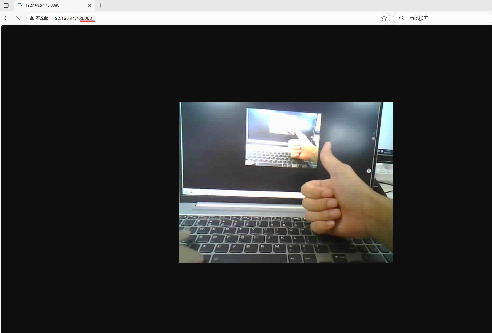
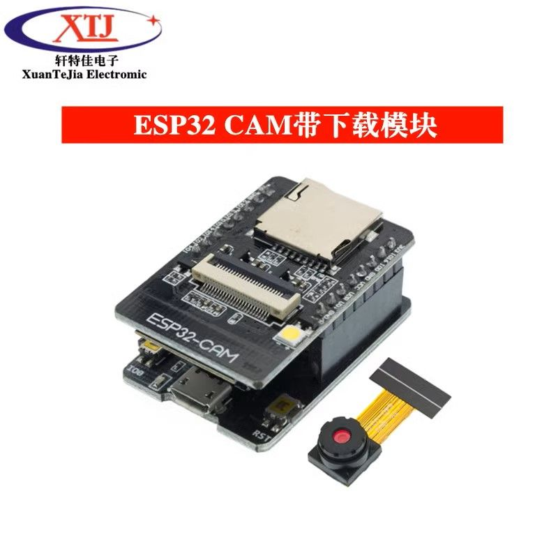
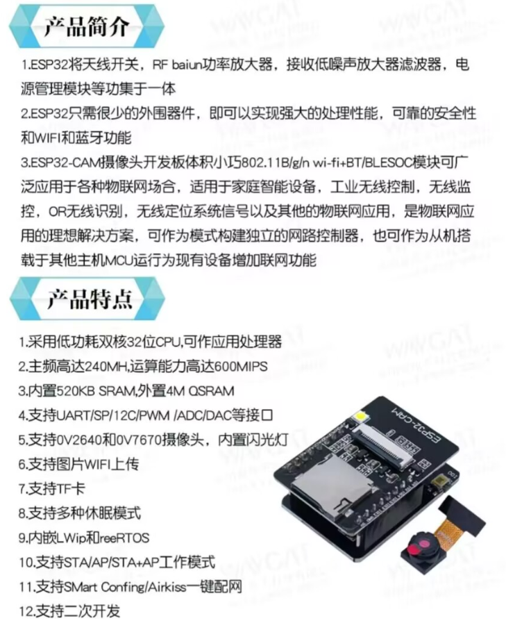
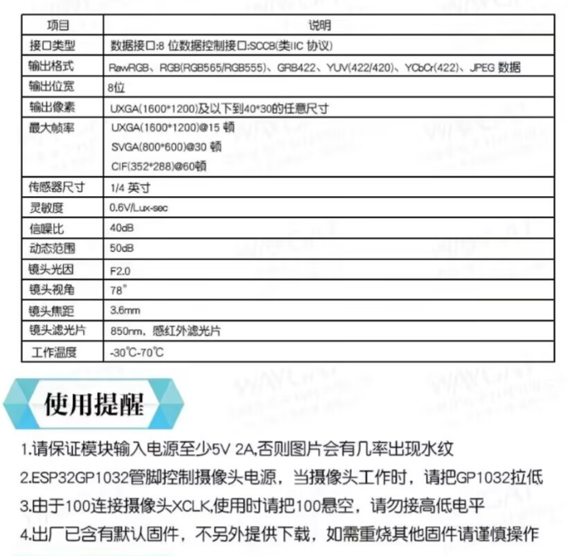
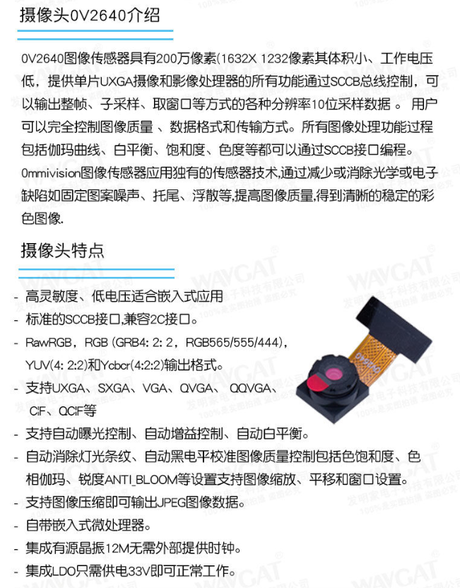

# ESP32-CAM + OV2640 轻量监控系统 📹

## 视频流展示图
> - 

## 项目简介 ✨
本仓库基于 ESP32-CAM 开发板与 OV2640 摄像头，实现了一套低成本轻量监控系统，支持局域网实时监控、公网访问（内网穿透）及 MQTT 远程控制功能。作为大三计算机专业学生的嵌入式练手项目，代码注重实战性与可维护性，适合作为嵌入式 / 物联网方向的简历项目案例。


## 硬件参数速览 📊

> - 
- （这里是我所购买的esp32cam模块参数，请以自己的开发板为准）
### 🖥️ ESP32-CAM 模块核心参数

| 特性 | 详情 |
|------|------|
| 处理器 | 双核240MHz ESP32，支持蓝牙4.2 + BLE 🛜 |
| 存储配置 | 4Mb SPI Flash +520kB SRAM + 4MB PSRAM (超大扩展内存) 💾 |
| WiFi性能 | 2.4GHz频段，支持802.11b/g/n，板载2dBi天线 📶 |
| 功耗控制 | Deep-sleep模式最低6mA，节能小能手 🌙 |
| 扩展接口 | 支持TF卡(最大4GB)、UART/SPI/I2C等 🔌 |
| 供电要求 | 4.75-5.25V，≥1A电源适配器，⚠须注意：输入电源低于5V2A时，图片会有几率出现水纹⚡|

> 完整硬件参数图：  
> -   
> - .png) 

### 📸 OV2640 摄像头核心参数
| 特性 | 详情 |
|------|------|
| 最高分辨率 | UXGA(1600×1200)@15fps 🚀 |
| 主流配置 | SVGA(800×600) / VGA(640×480)|
| 最大帧率 |UXGA(1600*1200)@15 帧；SVGA(800*600)@30帧；CIF(352*288)@60帧 |
| 输出格式 | 支持JPEG/RGB/YUV等，本项目用JPEG优化传输 📦 |
| 镜头参数 | F2.0光圈 + 78°广角 + 3.6mm焦距 🔍 |
| 接口类型 | 8位数据总线 + SCCB控制接口 (类I²C) |
> 完整硬件参数图：  
> - 
> -   


## 固件功能清单 🚀

### 核心功能 (已实现)
- 📹 摄像头采集：固定VGA(640×480)分辨率，JPEG格式输出
- 🔗 WiFi连接：STA模式自动重连(5次重试)，成功后打印IP
- 🌐 HTTP服务：8080端口提供视频流，仅支持1台设备查看

### 扩展功能 (待开发)
- 🌍 内网穿透：Ngrok实现公网访问 (Ngrok免费版已测试完成，部署过程之后完善)
- 📱 微信小程序：开发配套小程序客户端，支持视频流查看、截图指令发送
- 📸 远程截图：访问`/snapshot`保存图片到TF卡
- 📡 MQTT控制：接收指令开关摄像头，降低待机功耗

## 开发环境 🛠️
- 操作系统：Windows 11
- 开发工具：VSCode
- 框架版本：ESP-IDF v5.5.0  
  👉 [官方安装教程https://docs.espressif.com/projects/esp-idf/zh_CN/release-v5.5/esp32/get-started/index.html#get-started-how-to-get-esp-idf](https://docs.espressif.com/projects/esp-idf/zh_CN/release-v5.5/esp32/get-started/index.html#get-started-how-to-get-esp-idf)

## 快速上手 🚀
1. 克隆仓库并进入固件目录(使用ESP-IDF终端)
   ```bash
   git clone <仓库地址>
   cd esp32-cam/esp32cam_firmware
   ```

2. 配置WiFi参数，修改http视频流端口号和帧率（使用VSCODE）
 在此路径文件中修改wifi配置：esp32cam_firmware\main\wifi.h
 修改http视频流配置：esp32cam_firmware\main\http_server.h


3. 分区表配置（重要！否则会编译失败）
由于代码未优化，生成的.bin固件大小可能超过1MB，但默认分区表factory分区容量只有1MB，会导致如下报错：
```cpp
Error: app partition is too small for binary camera_test.bin size 0x10b070: Part 'factory' 0/0 @ 0x10000 size 0x100000 (overflow 0xb070)
/*
报错信息核心含义：
    应用程序二进制文件 camera_test.bin 大小为 0x10b070 (约1.045MB)
    factory 分区大小为 0x100000 (1MB)，起始地址 0x10000
    二进制文件大小超过分区容量，溢出 0xb070 字节 (45,168字节)
*/
```
**解决方案**：

- 第一步(本仓库已实现，直接做第二步)：在项目根目录新建 `partitions.csv`文件并添加以下内容，将factory分区容量增加至1.5MB：
```csv
# Name,   Type, SubType, Offset,  Size, Flags
nvs,      data, nvs,     0x9000,  0x6000,
phy_init, data, phy,     0xf000,  0x1000,
factory,  app,  factory, 0x10000, 0x150000,
```
- 第二步：通过menuconfig指定自定义分区表 运行命令打开图形界面：

```bash
idf.py menuconfig
```
导航路径：Partition Table → 选择Custom partition table CSV → 在Custom partition CSV file中输入partitions.csv，保存退出。

4. 启用PSRAM配置（解决摄像头初始化失败问题）
若串口日志中出现`PSRAM可用: 0 字节`或`摄像头初始化失败`，需配置启用PSRAM：  
运行以下命令打开图形配置界面：
```bash
idf.py menuconfig
```
依次导航并开启以下设置：  
 路径：`Component config → ESP32-specific config → Support for external, SPI-connected RAM`（启用外部SPI连接的RAM支持）  
 路径：`Component config → SPI RAM config → Initialize SPI RAM when booting the ESP32`（启动时初始化SPI RAM） 

5. 编译烧录 (使用ESP-IDF终端，并替换COMx为实际串口)
   ```bash
   idf.py -p COMx flash monitor
   ```

6. 浏览器访问串口打印的IP地址即可查看视频流 👀


## 注意事项 ⚠️
- 必须使用≥1A电源，否则摄像头可能初始化失败 ⚡
- 仅支持2.4GHz WiFi，5GHz频段无法连接 📶
- 扩展功能开发前建议检查Flash剩余容量(初始化时串口会输出剩余Flash物理容量) 💾

## 关于项目 📝
这是我作为大三计算机专业学生的嵌入式练手项目，主打一个"从0到1"的实战过程。目前只实现http视频流实时监控功能，后续会持续迭代扩展功能。如果对你有帮助，欢迎star🌟 鼓励一下~

有任何问题欢迎提Issue，一起交流学习呀！😊