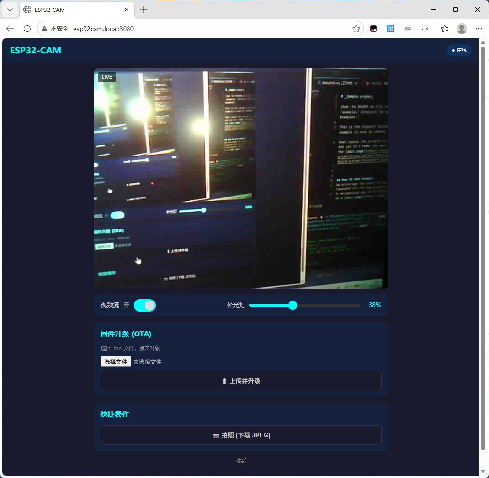
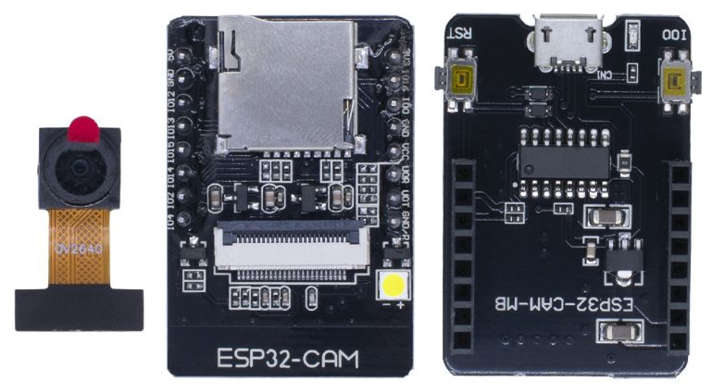
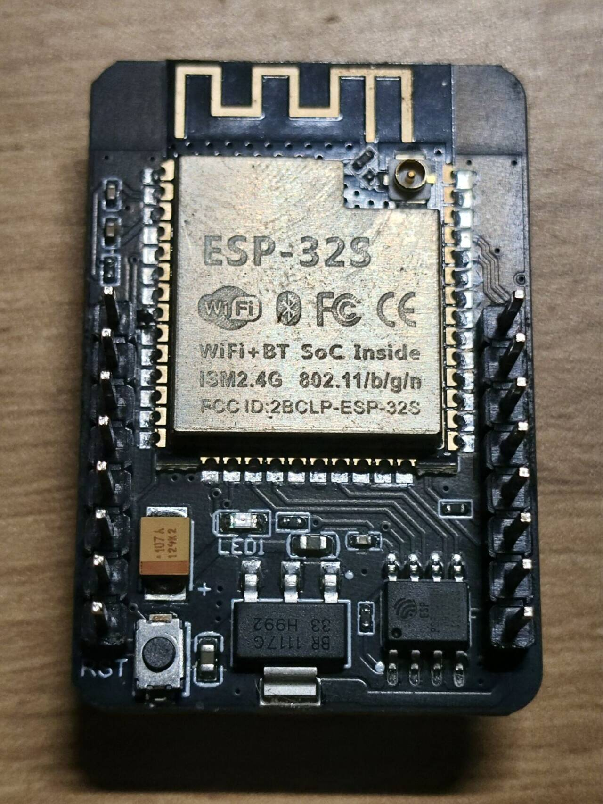

# ESP32-CAM + OV2640 轻量监控系统 📹

## 视频流展示图
- 图中的光斑为电脑屏幕反射的补光灯的灯光
> - 

## 项目简介 ✨
本仓库基于 ESP32-CAM 开发板与 OV2640 摄像头，实现了一套低成本轻量监控系统，支持局域网实时监控、公网访问（内网穿透）及 MQTT 远程控制功能。作为大三计算机专业学生的嵌入式练手项目，代码注重实战性与可维护性，适合作为嵌入式 / 物联网方向的简历项目案例。


## 固件功能清单 🚀

### 核心功能 (已实现)
- 📹 摄像头采集：固定VGA(640×480)分辨率，JPEG格式输出
- 🔗 WiFi连接：STA模式自动重连(5次重试)，成功后打印IP
- 🌐 HTTP服务：8080端口提供视频流，控制面板支持最多 5 路并发
- 🌐 **网页控制面板**：浏览器一键操控，视频流开关 + 补光灯 PWM 无极调光
- 🔍 **mDNS 设备发现**：浏览器输入 `esp32cam.local:8080` 直达，无需手动查 IP
- 📡 MQTT 通信：基于 EMQX 搭建服务端，ESP32-CAM 作为客户端实现双向通信
- 📱 微信小程序：开发配套小程序客户端，通过MQTT协议连接ESP32-CAM，支持视频流查看指令发送

### 扩展功能 (待开发)
- 📸 网页 OTA 固件升级（HTTP POST 上传 + SSE 进度反馈）
- 🌍 内网穿透：Ngrok实现公网访问 (Ngrok免费版已测试完成，部署过程之后完善)

## 🌐 网页控制面板

> 无需任何客户端工具 —— 浏览器打开即用，替代串口 + MQTTX + Python HTTP 服务器。

### 访问方式
```
# mDNS 零配置（推荐）
http://esp32cam.local:8080

# 或直接用 IP
http://<设备IP>:8080
```

### 面板功能

| 功能 | 路由 | 说明 |
|------|------|------|
| **MJPEG 视频流** | `GET /stream` | 浏览器原生 multipart/x-mixed-replace，30fps，异步 handler 不阻塞 API |
| **视频流开关** | `GET /api/stream?action=start\|stop` | Toggle Switch 启停 HTTP 视频流 |
| **补光灯调光** | `GET /api/led?brightness=0~100` | LEDC PWM 5kHz 10-bit + Gamma 2.2 矫正，Slider 实时渐变 |
| **OTA 升级** | `POST /upload` | 网页选 .bin 上传，SSE 进度反馈（开发中） |
| **拍照** | `GET /api/capture` | 浏览器下载 JPEG 照片 （开发中）|

### 技术要点

- **异步 MJPEG**：`stream_task` 在独立 FreeRTOS 任务中运行，`httpd_req_async_handler_begin()` 释放 HTTP Server 任务，确保 API 请求不被阻塞
- **LED PWM 无极调光**：GPIO4 经 NPN 反相驱动（低电平=灭），Gamma 2.2 校正模拟人眼非线性亮度感知
- **纯 HTTP 协议**：控制面板完全基于 HTTP/1.1，不依赖 MQTT（MQTT 仅保留用于远程指令/小程序）

## 开发环境 🛠️
- 操作系统：Windows 11
- 开发工具：VSCode
- 框架版本：ESP-IDF v5.5.0（这是我之前下载的，截至2025.10.16，官方最新稳定版本是 v5.5.1）
    👉 [ESP-IDF官方安装教程https://docs.espressif.com/projects/esp-idf/zh_CN/release-v5.5/esp32/get-started/index.html#get-started-how-to-get-esp-idf](https://docs.espressif.com/projects/esp-idf/zh_CN/release-v5.5/esp32/get-started/index.html#get-started-how-to-get-esp-idf)

## 快速上手 🚀
1. 克隆仓库并进入固件目录
   ```bash
   git clone <仓库地址>
   cd esp32-cam/esp32cam_firmware
   ```
2. 配置WiFi参数，修改http视频流端口号和帧率（使用VSCODE）
   在此路径文件中修改wifi配置：esp32cam_firmware\main\wifi.h
   修改http视频流配置：esp32cam_firmware\main\http_server.h
3. 分区表配置（重要！否则可能会编译失败）
   由于代码未优化，生成的.bin固件大小可能超过默认分区表factory分区容量（通常为1MB），会导致如下报错：
   ```
   Error: app partition is too small for binary camera_test.bin size 0x10b070:
   Part 'factory' 0/0 @ 0x10000 size 0x100000 (overflow 0xb070)
   ```
   **解决方案**：
   - 第一步(本仓库已实现，直接做第二步)：在项目根目录新建 `partitions.csv`文件并添加以下内容，将factory分区容量增加至1.5MB：
   ```csv
   # Name,   Type, SubType, Offset,  Size, Flags
   nvs,      data, nvs,     0x9000,  0x6000,
   phy_init, data, phy,     0xf000,  0x1000,
   factory,  app,  factory, 0x10000, 0x150000,
   ```
   - 第二步：通过menuconfig指定自定义分区表
   运行命令打开图形界面：
   ```bash
   idf.py menuconfig
   ```
   导航路径：`Partition Table → 选择Custom partition table CSV → 在Custom partition CSV file中输入partitions.csv`，保存退出。
4. 启用PSRAM配置（解决摄像头初始化失败问题）
   若串口日志中出现`PSRAM可用: 0 字节`或`摄像头初始化失败`，需配置启用PSRAM：
   运行以下命令打开图形配置界面：
   ```bash
   idf.py menuconfig
   ```
   依次导航并开启以下设置：
      路径：`Component config → ESP32-specific config → Support for external, SPI-connected RAM`（启用外部SPI连接的RAM支持）
      路径：`Component config → SPI RAM config → Initialize SPI RAM when booting the ESP32`（启动时初始化SPI RAM）
5. 编译烧录 (使用ESP-IDF终端，并替换COMx为实际串口)
   ```bash
   idf.py -p COMx flash monitor
   ```
6. 浏览器访问 `http://esp32cam.local:8080`（mDNS）或串口打印的IP地址即可进入网页控制面板 👀

## 注意事项 ⚠️
- 必须使用≥1A电源，否则摄像头可能初始化失败，根据商家资料得知，输入电源低于5V2A时，图片可能会出现水纹⚡
- 仅支持2.4GHz WiFi，5GHz频段无法连接 📶
- 扩展功能开发前建议检查Flash剩余容量(初始化时串口会输出剩余Flash物理容量) 💾
- Windows 访问 `esp32cam.local` 需安装 Bonjour 服务（iTunes 自带，或苹果官网下载）

## 关于项目 📝
这是我作为大三计算机专业学生的嵌入式练手项目，主打一个"从0到1"的实战过程。目前已实现 HTTP 视频流 + 网页控制面板（补光灯调光/视频流开关）+ MQTT 远程控制 + 微信小程序。后续会持续迭代扩展功能。如果对你有帮助，欢迎star🌟 鼓励一下~


## 项目进展 🚧

### ✅ 已完成
- [√] ESP32-CAM硬件基础配置
- [√] WiFi连接功能实现 (含 mDNS 设备发现)
- [√] HTTP视频流服务搭建 (异步 handler, 5 路并发)
- [√] 网页控制面板 (视频流开关 + 补光灯 PWM 调光)
- [√] MQTT通信功能实现
- [√] 微信小程序开发
- [√] 前端-硬件打通，实现实时视频流查看

### 🚧 进行中
- [ ] 网页 OTA 固件上传升级 (HTTP POST + SSE 进度)
- [ ] MQTT 远程控制功能完善

### 🎯 下一步计划
1. 完成网页 OTA 固件升级功能，支持浏览器选 .bin 文件上传升级
2. 重构项目架构：MQTT 仅保留控制指令，HTTP 负责视频流 + OTA
3. 开发内网穿透功能，实现公网访问

最后附上硬件参数，有任何问题欢迎提Issue，一起交流学习呀！😊

## 硬件参数速览 📊
### 🖥️ ESP32-CAM 模块核心参数
| 特性 | 详情 |
|------|------|
| 处理器 | 双核240MHz ESP32，支持蓝牙4.2 + BLE 🛜 |
| 存储配置 | 4Mb SPI Flash +520kB SRAM + 4MB PSRAM (超大扩展内存) 💾 |
| WiFi性能 | 2.4GHz频段，支持802.11b/g/n，板载2dBi天线 📶 |
| 功耗控制 | Deep-sleep模式最低6mA，节能小能手 🌙 |
| 扩展接口 | 支持TF卡(最大4GB)、UART/SPI/I2C等 🔌 |
| 供电要求 | 4.75-5.25V，≥1A电源适配器，⚠须注意：输入电源低于5V2A时，图片会有几率出现水纹⚡|


### 📸 OV2640 摄像头核心参数
| 特性 | 详情 |
|------|------|
| 最高分辨率 | UXGA(1600×1200)@15fps 🚀 |
| 主流配置 | SVGA(800×600) / VGA(640×480)|
| 最大帧率 |UXGA(1600*1200)@15 帧；SVGA(800*600)@30帧；CIF(352*288)@60帧 |
| 输出格式 | 支持JPEG/RGB/YUV等，本项目用JPEG优化传输 📦 |
| 镜头参数 | F2.0光圈 + 78°广角 + 3.6mm焦距 🔍 |
| 接口类型 | 8位数据总线 + SCCB控制接口 (类I²C) |
- esp32-cam外观图（左侧OV2640摄像头，中间ESP32-CAM开发板，右侧烧录扩展板）

- 开发板芯片模组面图



